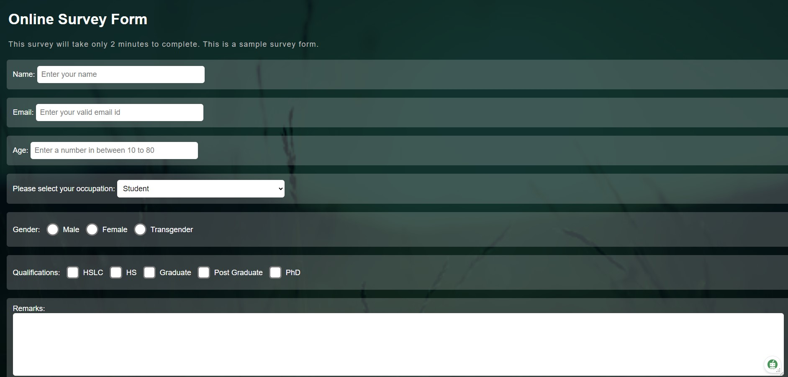

# Survey Form CSS, HTML Project

The **Survey Form** project was a beginner-level web development project that used HTML and CSS to create a simple, responsive form for gathering user feedback or information. The goal of this project was to practice HTML form elements and styling them using CSS.

## HTML Structure
The HTML structure typically includes:

1. **Form Element**:
   - The main container for the survey form is wrapped in the `<form>` tag.
   - It includes attributes like `action` (to define where the form data will be sent) and `method` (to specify how the data will be submitted, either `GET` or `POST`).

2. **Form Inputs**:
   The form collects various types of user input:
   - **Text Inputs** (`<input type="text">`): Used to collect information like name, email, etc.
   - **Radio Buttons** (`<input type="radio">`): Allow users to select one option from a group.
   - **Checkboxes** (`<input type="checkbox">`): Allow multiple selections from a set of options.
   - **Dropdown Menus** (`<select>`): Display predefined options in a dropdown.
   - **Text Areas** (`<textarea>`): Provide open-ended feedback or comments.
   - **Submit Button** (`<button type="submit">` or `<input type="submit">`): Submits the completed form.

## CSS Styling
CSS is used to style the form for a better user experience:

1. **Form Layout**:
   - CSS techniques like Flexbox or Grid are used to align form elements neatly.
   - Forms are designed to look clean and organized, with proper spacing using padding, margins, and borders.

2. **Input Styling**:
   - Inputs, checkboxes, radio buttons, and buttons are styled for uniformity.
   - Customize background colors, fonts, and sizes to enhance visual appeal.
   - Use hover and focus effects to highlight form fields when interacted with.

3. **Responsiveness**:
   - Media queries ensure the form is responsive on both desktop and mobile devices.
   - For mobile layouts, fields may stack vertically, and buttons are made larger for touch interaction.

4. **Form Validation Styling**:
   - Use CSS pseudo-classes like `:invalid` and `:valid` to style input fields based on their validity (e.g., highlighting invalid fields in red).

## Features of the Survey Form
- **Header**: A title or introduction to the form, such as "Customer Feedback Survey" or "User Satisfaction Survey".
- **Questions**: A series of questions with various input types to gather data.
- **Form Controls**: Inputs like text fields, radio buttons, checkboxes, dropdowns, and text areas to collect user responses.
- **Submit Button**: A button that users click to submit their responses.

## Objectives of the Project
- **HTML Forms**: Learn how to create HTML forms using various input elements.
- **CSS Styling**: Practice using CSS to style and organize the form elements.
- **Responsive Design**: Make sure the form looks and works well on all device sizes (desktop, tablet, mobile).
- **User Experience**: Design the form to be intuitive and easy for users to fill out.

## Additional Enhancements
- **Form Validation**: Optionally, you can add JavaScript for client-side validation to ensure the user fills out the form correctly before submission.
- **Backend Integration**: You can further extend the project by integrating a backend (e.g., PHP, Flask, or Node.js) to process and store the form data.
